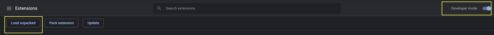

# GitHub Extension

[](https://app.circleci.com/pipelines/github/MarioArranzAgueda/github-extension)


This project allow us to install an extension in our chrome browser and open a new tab with our Github user and check our activity feed, repositories, followers and our information.

To install this project as extension, we need to execute next command:

```shell 
npm run build
```

Now, that build folder is generate, we need to go to chrome [extension](chrome://extensions/) enable developer mode and click load unpacked and find build folder to install.



## Test in local

If you want to test this extension in your local environment, you need to install dependencies:

```shell
npm i
````

and then, start project in your [localhost:3000](http://localhost:3000), executing next command:

```shell
npm start
```